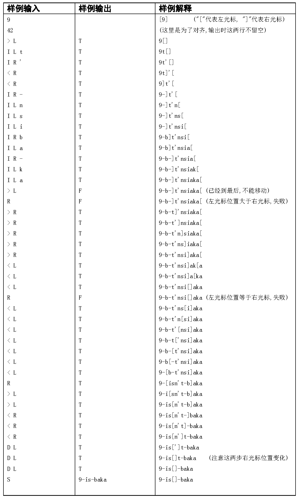

# CST2021F 1-6 ⑨的完美文本编辑器

------

### **题目来源**

　　Tsinghua Online Judge 原创，出题人 hzhwcmhf、Tony

### **描述**

　　因为⑨是天才，所以经常处理一些文本信息。

　　但是因为需要处理的东西实在是太多啦，所以⑨发明了一个完美的文本编辑器。这个编辑器拥有两个光标（cursor），所以⑨能够同时在两处地方插入和删除文本。这个编辑器除了正常的编辑功能以外，还有一些只有⑨才知道用处的功能，例如翻转两个光标之间的文本。某一天，⑨把自己的完美文本编辑器给弄丢了，但是她还有好多好多文本需要处理。于是她想请聪明又智慧的你帮她实现完美文本编辑器的一些功能。

　　功能列表如下：

| 功能名称       | 命令格式 | 说明                                                         |
| :------------- | :------- | :----------------------------------------------------------- |
| < (move left)  | < w      | w 为一个字符，不是“L”就是“R”，代表是为左光标还是右光标（下同）。该命令将选定光标向左移动，如果已经是最左端则不移动。 命令执行成功时输出“T”，否则（此时光标已经在最左端）输出“F”。 |
| > (move right) | > w      | w 同上。与F 命令不同的是，该命令将光标向右移动。命令执行成功时输出“T”，否则（光标已经在最右端）输出“F”。 |
| I (insert)     | I w c    | w 同上。c 是一个可见字符（33 ≤ ascii码 ≤ 126），代表在该光标**左**插入该字符。该命令始终输出“T”。 |
| D (delete)     | D w      | w 同上。代表删除该光标**右**的一个字符。命令执行成功时输出“T”，否则（此时光标右侧没有字符）输出“F”。 |
| R (reverse)    | R        | 代表翻转左光标和右光标之间的字符。该命令只有左光标在右光标左侧时才能执行（**两光标重合时也不能执行**）。 命令执行成功时输出“T”，否则输“F”。 |
| S (show)       | S        | 代表显示当前处理的文本。该命令只输出文本，不输出“T”或“F”。   |

开始时文本编辑器中有一定内容，左光标在第一个字符左，右光标在最后一个字符右。

注意：**在插入和删除操作中，没有被操作的光标与文本的相对左右位置保持不变。特别地，若两个光标重叠，操作后也仍然重叠。**

### **输入**

　　第一行是初始时文本编辑器内容。

　　第二行是一个正整数N，N表示操作次数。

　　接下来有N行，每行有一个命令，命令格式如上方表格。

### **输出**

　　对于每个命令，按上方表格要求执行并输出。

### **输入样例**

```
9
42
> L
I L t
I R '
< R
< R
I R -
I L n
I L s
I L i
I R b
I L a
I R -
I L k
I L a
> L
R
> R
> R
> R
> R
> R
< L
< L
< L
R
< L
< L
< L
< L
< L
< L
< L
R
> L
> L
< R
< R
< R
D L
D L
D L
S
```

　　*此样例是第1个测试点

### **输出样例**

```
T
T
T
T
T
T
T
T
T
T
T
T
T
T
F
F
T
T
T
T
T
T
T
T
F
T
T
T
T
T
T
T
T
T
T
T
T
T
T
T
T
9-is-baka
```

### **样例解释**



### **数据范围**

　　初始字符、插入字符是可见字符（33 ≤ ascii码 ≤ 126）

　　1 ≤ 初始文本长度 ≤ 3,200,000

　　1 ≤ N ≤ 4,000,000

　　输出文件大小 ≤ 20 MB

### **资源限制**

　　时间：0.5 sec

　　空间：256 MB

### **提示**

　　● 列表。

　　● 使用数组集中存放链表节点可以提高效率。

