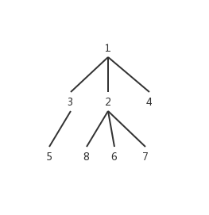
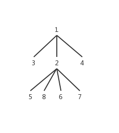

# CST2021F 2-1 Build

------

### **描述**

#### 多叉树

多叉数是一种常见的数据结构，一个含有N个节点的多叉树，可以通过邻接表来表示，例如



可以使用

```
3 3 2 4
3 8 6 7
1 5
0
0
0
0
0
```

来表示，第i行表示第i个节点（i从1开始，范围是为[1, N]），第1个数字为孩子个数，右边为子节点列表，按照从左到右的方式给出。我们规定根节点的编号一定为1。

#### 节点表示

另外，除了按照节点上面的数字来表示一个节点外，我们还可以通过从根节点出发的路径来表示一个节点，例如节点7可以表示为

```
2 1 2
```

路径开头为该路径长度，后面数字的含义是从根节点出发到达节点7，首先经过根节点的第1个孩子2（序从0开始），然后再经过节点2的第2个孩子，到达节点7。但是这样的一条路径有可能在多叉树中并不对应任何一个节点，例如

```
3 1 2 3
```

中的第二个3，由于节点7并没有孩子，所以该路径并不对应多叉树中的节点。我们规定，一条并不对应任何节点的路径仍旧是**合法**的，其表示在该路径上的最后一个合法节点，所以上述路径仍表示节点7，同理

```
9 1 2 3 3 3 3 1 2 3
```

同样表示节点7。

#### 子树移动

在多叉树上，我们定义**子树移动**操作：移动操作指定**源子树s**、**目的位置d**，将源子树s移动到目的位置d表示将子树s从其父亲节点中剔除，插入到位置d处。

对于源子树，我们仍旧使用**节点表示**一节给出的表示方法指定。

对于目的位置，我们使用目的位置处的父节点和插入位置在孩子序列中的rank来表示，父节点同样采用**节点表示**一节给出的表示方法指定。

例如，对于上面的多叉树，将子树

```
2 0 0
```

移动到节点

```
1 1
```

的孩子序列中的

```
0
```

位置，得到的新多叉树为



另外，长度为L的序列，其rank取值为[0, L]，L表示插入后子树位于序列的最后一个位置。我们保证源子树不为根。

目的位置的节点表示为移除源子树后的节点表示。

例如，对于最上面的多叉树，将子树

```
2 1 1
```

移动到节点

```
1 1
```

的孩子序列中的

```
2
```

位置，得到的新多叉树为


对于子树移动操作，我们定义该操作的cost为源子树和目标位置表示中使用到的路径的路径长度及其中所有rank之和，例如对于上面的例子而言，该操作的cost为

```
(2 + 1 + 1) + (1 + 1) + 2 = 8
```

#### 查询

对于一个节点，我们查询其**高度**和**子树规模**，其定义详见讲义。

对于查询操作，我们定义其cost为待查询位置表示中的路径的路径长度及其中所有rank之和。

### **输入**

第一行：两个整数，N，M，表示多叉树有N个节点，子树移动和查询操作共有M个。

接下来N行以邻接表的形式指定多叉树。

接下来是M个操作：

一个子树移动操作以4行表示：第一行是0；第二行指出源子树；第三行指出目的位置的父节点；第四行指出目的位置的rank。

一个查询操作以2行表示：第一行是1或2，1表示查询高度，2表示查询子树规模；第二行指出待查询节点（子树）。

### **输出**

对于每个查询操作，输出相应的查询结果，每个结果占一行。

### **输入样例**

```
8 3
3 3 2 4
3 8 6 7
1 5
0
0
0
0
0
0
3 0 0 2
3 1 2 3
0
1
1 1
2
1 1
```

### **输出样例**

```
2
5
```

### **限制**

1 ≤ N ≤ 106

1 ≤ M ≤ 104

所有操作的cost之和 ≤ 106

时间：1 sec

空间：256 MB

### **提示**

- 子树删除、插入时可能需要遍历和移动大量节点，因此设计孩子的存储方式时需要格外小心，把复杂度控制在cost范围内。
- 注意维护高度、子树规模时避免遍历所有孩子。